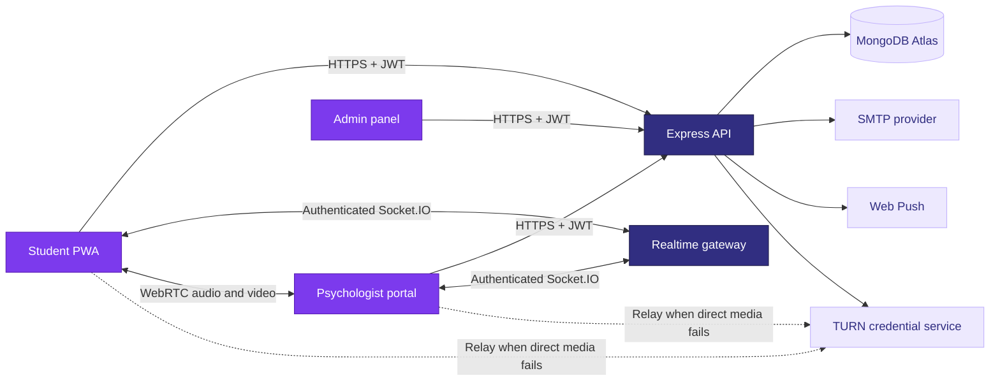

<div align="center">
  
  <h1>Bodhi-Mitra</h1>
  <p><strong>Private, immediate mental-health support for Gautam Buddha University students.</strong></p>
  <p>A full-stack crisis-support platform connecting students with university-approved psychologists through secure chat, voice, and video sessions.</p>
  <p>
    <a href="https://bodhimitra.netlify.app/"></a>
    <a href="https://nodejs.org/"></a>
    <a href="https://www.typescriptlang.org/"></a>
    <a href="https://bodhimitra.netlify.app/"></a>
  </p>
  <sub>Developed for Gautam Buddha University with privacy, accessibility, and compassionate care at its core.</sub>
</div>

---

> [!IMPORTANT]
> Bodhi-Mitra supports access to qualified mental-health professionals, but it is not a replacement for emergency services. For immediate danger, call **112**. Campus crisis hotline: **+91 9650257255**.

## Why Bodhi-Mitra

Students often need support at the exact moment asking for help feels hardest. Bodhi-Mitra provides a private, student-first path from requesting assistance to speaking with a verified psychologist, while giving university administrators the operational tools required to manage care responsibly.

<table>
  <tr>
    <td width="33%"><strong>Private by design</strong><br />Psychologists see an anonymous student identity during support sessions.</td>
    <td width="33%"><strong>Real-time support</strong><br />Chat, voice, and video sessions use Socket.IO signaling and WebRTC media.</td>
    <td width="33%"><strong>University governed</strong><br />Administrators verify psychologists, review reports, and monitor metadata-only analytics.</td>
  </tr>
</table>

## Platform capabilities

| Student experience                                | Psychologist workspace               | Administration                     |
| :------------------------------------------------ | :----------------------------------- | :--------------------------------- |
| OTP-verified registration and password login      | Live emergency request queue         | Psychologist credential management |
| Password recovery through verified email          | Chat, voice, and video support rooms | Student and session oversight      |
| Emergency request confirmation and mode selection | Anonymous student-facing sessions    | Assessment analytics               |
| Mood and urgency context                          | Safety escalation tools              | Safety report resolution           |
| Weekly bilingual wellbeing assessment             | Private temporary scratchpad         | Platform metrics and reporting     |
| Session history and profile                       | Availability and session history     | Expert-directory publishing        |
| Installable Progressive Web App                   | Responsive clinical workspace        | Role-protected control panel       |

## Application preview

<div align="center">
  
</div>

## Technology

| Layer          | Technology                                                      |
| :------------- | :-------------------------------------------------------------- |
| Frontend       | React 19, TypeScript, Vite, React Router, Phosphor Icons        |
| Backend        | Node.js, Express 5, TypeScript, Socket.IO                       |
| Database       | MongoDB and Mongoose                                            |
| Validation     | Shared Zod schemas and socket contracts                         |
| Authentication | JWT, bcrypt, email OTP, role-based authorization                |
| Realtime       | Socket.IO rooms and authenticated event handlers                |
| Calls          | Native WebRTC, STUN, authenticated short-lived TURN credentials |
| Notifications  | Nodemailer email delivery and Web Push with VAPID               |
| Hosting        | Netlify frontend, Render backend, MongoDB Atlas                 |

## Architecture



The backend is the privacy boundary. It validates every API and socket payload, authorizes session participants, and removes student identity from psychologist-facing responses.

### Emergency lifecycle

```text
pending -> matched -> ended
pending -> timeout
pending -> cancelled
```

Emergency acceptance uses an atomic MongoDB update, so only one psychologist can claim a pending request.

## Repository structure

```text
Bodhi-Mitra/
├── frontend/              React application and PWA
│   ├── public/            Logos, illustrations, manifests, robots and sitemap
│   └── src/
│       ├── components/    Reusable UI, authentication, emergency and session modules
│       ├── context/       Authentication state
│       ├── lib/           API, socket and browser helpers
│       └── pages/         Public, student, psychologist and admin screens
├── backend/               Express API and Socket.IO server
│   ├── src/
│   │   ├── controllers/   HTTP request handlers
│   │   ├── middleware/    Authentication and error handling
│   │   ├── models/        Mongoose models
│   │   ├── routes/        API routes
│   │   ├── services/      Emergency matching and application services
│   │   └── socket/        Authenticated realtime events
│   └── tests/             Backend security and workflow tests
├── shared/                Shared Zod schemas, types and socket event names
├── ARCHITECTURE.md        Privacy boundaries and system lifecycle
└── package.json           npm workspace commands
```

## Local development

### Requirements

- Node.js 20 or newer
- npm 10 or newer
- Local MongoDB or a MongoDB Atlas connection
- SMTP credentials when testing real email delivery

### 1. Install dependencies

```bash
git clone https://github.com/unseenap/Bodhi-Mitra.git
cd Bodhi-Mitra
npm install
```

### 2. Create environment files

```powershell
Copy-Item backend/.env.example backend/.env
Copy-Item frontend/.env.example frontend/.env
```

On macOS or Linux:

```bash
cp backend/.env.example backend/.env
cp frontend/.env.example frontend/.env
```

Replace placeholder values in `backend/.env`. Never commit real secrets.

### 3. Seed the administrator

```bash
npm run seed
```

The seed uses `ADMIN_EMAIL` and `ADMIN_PASSWORD` from `backend/.env`. Change the temporary password immediately after the first sign-in.

### 4. Start both applications

```bash
npm run dev
```

| Service      | Local address                      |
| :----------- | :--------------------------------- |
| Frontend     | `http://localhost:5173`            |
| Backend      | `http://localhost:4000`            |
| Health check | `http://localhost:4000/api/health` |

When SMTP is empty during development, generated OTP codes are written to the backend terminal.

## Environment configuration

### Frontend

| Variable                | Purpose                               |
| :---------------------- | :------------------------------------ |
| `VITE_API_URL`          | Express API base URL ending in `/api` |
| `VITE_SOCKET_URL`       | Socket.IO backend origin              |
| `VITE_VAPID_PUBLIC_KEY` | Public Web Push key                   |
| `VITE_STUN_URL`         | Comma-separated STUN server URLs      |
| `VITE_TURN_*`           | Local-development fallback only       |

### Backend

| Variable             | Purpose                                       |
| :------------------- | :-------------------------------------------- |
| `MONGODB_URI`        | MongoDB connection string                     |
| `JWT_SECRET`         | Minimum 32-character signing secret           |
| `CLIENT_URL`         | Exact deployed frontend origin                |
| `SMTP_*`             | Nodemailer transport configuration            |
| `VAPID_*`            | Web Push credentials                          |
| `TURN_URL`           | Comma-separated TURN UDP, TCP, and TLS URLs   |
| `TURN_SHARED_SECRET` | Coturn REST authentication secret             |
| `TURN_TTL_SECONDS`   | Lifetime of participant-only TURN credentials |
| `ADMIN_EMAIL`        | Seeded administrator email                    |
| `ADMIN_PASSWORD`     | Seeded temporary administrator password       |

> [!CAUTION]
> Variables beginning with `VITE_` are embedded in public frontend JavaScript. Production TURN secrets, SMTP passwords, database credentials, JWT secrets, and administrator passwords belong only in the backend hosting environment.

## Reliable voice and video

STUN alone is not sufficient for production calls. Configure Coturn or a managed TURN provider on the backend:

```env
TURN_URL=turn:relay.example.edu:3478?transport=udp,turn:relay.example.edu:3478?transport=tcp,turns:relay.example.edu:5349?transport=tcp
TURN_SHARED_SECRET=replace-with-your-coturn-rest-secret
TURN_TTL_SECONDS=3600
```

The backend verifies that the requester belongs to the active session, then generates short-lived HMAC credentials. Permanent TURN credentials are never shipped to the browser.

For realistic testing, use two devices on different networks and allow microphone or camera permissions on both devices.

## Quality checks

```bash
npm run typecheck
npm test
npm run build
```

| Command             | What it validates                               |
| :------------------ | :---------------------------------------------- |
| `npm run dev`       | Starts API and frontend development servers     |
| `npm run typecheck` | Checks all TypeScript workspaces                |
| `npm test`          | Runs shared, backend, and frontend tests        |
| `npm run build`     | Creates production backend and frontend builds  |
| `npm run seed`      | Creates or updates the configured administrator |

## Privacy and security model

- Student identity is omitted from psychologist-facing API and socket payloads.
- Chat messages are relayed through private Socket.IO rooms and are not persisted.
- WebRTC media is peer-to-peer when possible and uses TURN only when required.
- Session membership is verified before joining, signaling, messaging, ending, or obtaining TURN credentials.
- Authentication, OTP, messaging, signaling, and session actions are rate-limited.
- Inputs are validated with strict shared Zod schemas.
- The database stores request and session metadata, not conversation content.
- Psychologists are created and verified through the administrator panel.

> [!NOTE]
> The final university-approved legal retention policy is still pending. Review `ARCHITECTURE.md` and complete the legal, safeguarding, accessibility, and clinical-governance review before a public launch.

## Production checklist

- [ ] Configure MongoDB Atlas network access, backups, and encryption at rest
- [ ] Set a unique production `JWT_SECRET`
- [ ] Configure SMTP and verify the sender domain
- [ ] Configure VAPID keys for push notifications
- [ ] Configure authenticated TURN UDP, TCP, and TLS endpoints
- [ ] Set `CLIENT_URL` to the exact deployed frontend origin
- [ ] Confirm the campus hotline number and operating hours
- [ ] Replace the seeded administrator password
- [ ] Verify every psychologist credential before activation
- [ ] Complete privacy, retention, safeguarding, and accessibility review
- [ ] Test chat, voice, video, emergency timeout, and reconnect flows on real devices

## Project team

<table>
  <tr>
    <td align="center"><strong>Abhishek Prajapati</strong><br /><sub>Managed and developed</sub></td>
    <td align="center"><strong>Abhinav Kumar</strong><br /><sub>Managed and developed</sub></td>
    <td align="center"><strong>Vivek Khatkar</strong><br /><sub>Managed and developed</sub></td>
  </tr>
</table>

## Documentation

- [Architecture and privacy boundaries](./ARCHITECTURE.md)
- [Backend environment template](./backend/.env.example)
- [Frontend environment template](./frontend/.env.example)
- [Live application](https://bodhimitra.netlify.app/)

---

<div align="center">
  
  <br />
  <strong>Bodhi-Mitra</strong><br />
  <sub>Solace to your mind.</sub>
</div>
